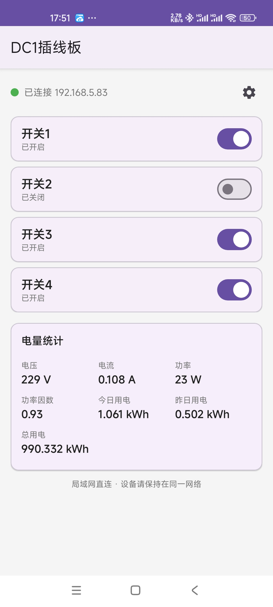

# DC1插线板安卓客户端

斐讯 DC1 智能插线板的安卓控制客户端 —— 原生 Kotlin 编写，支持**多设备管理**、四路开关控制、电量统计。

## 功能特性

- 📱 **多设备管理**：支持添加多个 DC1 插线板，每个设备可设置别名（如"客厅排插"、"卧室排插"），长按卡片可编辑/删除
- 🔌 **四路开关独立控制**：大卡片 + 开关拨钮，一键全开/全关
- ⚡ **实时状态**：2.5 秒轮询（可在设置中调整），在线/离线检测，卡片上直接显示四路开关状态
- 📊 **电量统计**：电压、电流、功率、功率因数、今日/昨日/总用电量（与固件数据同源）
- ✏️ **自定义命名**：设备别名 + 四个开关分别命名
- 🌐 **纯局域网直连**：不依赖任何云服务，数据不出家门

## 适配固件（重要）

本客户端对接的是 DC1 自定义固件 **esp_dc1**（[qlwz/esp_dc1](https://github.com/qlwz/esp_dc1)，作者：情留メ蚊子）的 **Web HTTP 接口**，**无需对固件做任何修改**。

**兼容条件：**

1. 固件为 esp_dc1 或其保留下列 HTTP 接口的衍生版本（包括基于 `v2020.07.11.2000` 及之后版本编译的自定义构建）
2. 手机与插线板处于**同一局域网**，固件 Web 服务端口为默认 80
3. 固件 Web 界面能正常打开（`http://<设备IP>/`），则本客户端即可使用

**使用的接口协议：**

| 接口 | 方法/参数 | 说明 |
|---|---|---|
| `/dc1_do` | POST，`c=1~4`，`do=on` / `do=off` / `do=T` | 开关控制（on=开，off=关，T=翻转），响应直接带回全量状态 |
| `/get_status` | POST，`i=0` | 查询状态：`power1~4`、`voltage`、`current`、`power`、`apparent_power`、`reactive_power`、`factor`、`today`、`yesterday`、`total`、`starttime` |

> 说明：客户端发送**明确的 on/off 指令**（而非翻转），因此与网页端、MQTT、HomeAssistant 等其它控制入口状态实时同步，不会互相冲突。

## 界面截图



## 构建方法

- 环境要求：JDK 17、Android SDK（`compileSdk 34`，`minSdk 24`）
- 国内网络已配置阿里云 Maven 镜像（见 `settings.gradle.kts`）
- 构建：
  ```bash
  gradle assembleRelease
  ```
- 产物：`app/build/outputs/apk/release/app-release-unsigned.apk`，需自行用 `zipalign` + `apksigner` 签名（个人 keystore 即可）

## 下载

最新已签名 APK 见 **Releases** 页面。

## 技术栈

- Kotlin + AndroidX（AppCompat / Material Components）
- 无第三方网络依赖：HTTP 使用 `HttpURLConnection`，JSON 解析使用系统 `org.json`
- 配置存储：`SharedPreferences`（JSON 格式多设备列表）

## 相关项目

- 固件：[qlwz/esp_dc1](https://github.com/qlwz/esp_dc1)（斐讯 DC1 自定义固件，含 Web UI / MQTT / HomeAssistant 支持）

## License

[MIT](LICENSE)
